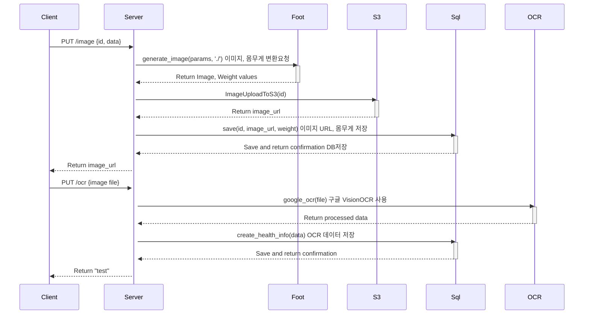

### Carenco-flask-server-hl API
FootPrint이미지 추출과 인바디 결과지 OCR을 위한 RESTful API입니다.

Swagger-UI가 적용되어 있습니다.

## route.py 엔드포인트


### 이미지 가공 및 저장 API

- **URL:** `/image`
- **메서드:** PUT
- **파라미터:**
  - `id` (필수, 문자열): 사용자 아이디
- **요청 본문 예시 :**
  ```json
  {
    "id": "TEST",
    "data": "foot_data.json"
  }
- **응답:**
  - `200 OK`: 이미지 가공 및 저장 성공
  - `400 Bad Request`: 잘못된 요청
  - `500 Internal Server Error`: 서버 오류

### 헬스 체크 API

- **URL:** `/health`
- **메서드:** GET
- **파라미터:** 없음
- **요청 본문 예시 :** 없음
- **응답:**
  - `200 OK`: 서버가 올바르게 실행되고 있는지 확인

### 체크 API

- **URL:** `/check`
- **메서드:** GET
- **파라미터:** 없음
- **요청 본문 예시 :** 없음
- **응답:**
  - `200 OK`: 서버가 올바르게 실행되고 있는지 확인

### Inbody 이미지 OCR 처리 API

- **URL:** `/ocr`
- **메서드:** PUT
- **파라미터:**
  - `file` (필수, 파일): 이미지 파일
- **요청 본문 예시 :**
  이 API는 이미지 파일을 `file` 파라미터를 통해 받습니다. 따라서 본문 예시는 제공되지 않습니다.
- **응답:**
  - `200 OK`: 이미지 OCR 처리 성공
  - `400 Bad Request`: 이미지 파일 누락
  - `500 Internal Server Error`: 서버 오류 

## 개발 환경 설정

1. 저장소를 복제합니다.
2. 필요한 종속성을 설치합니다. 
   - 이를 위해 `pip install -r requirements.txt` 명령어를 실행하면 됩니다. 
3. 필요한 설정 파일을 구성합니다.
   - 예를 들어, 데이터베이스 연결 설정, API 키 등을 설정해야 합니다.
4. 애플리케이션을 실행합니다.
   - 애플리케이션은 `python route.py` 명령어로 실행할 수 있습니다.

## 기여

기여는 환영합니다! 문제를 발견하거나 새로운 기능을 추가하려면 이슈를 열거나 Pull Request를 제출해주세요.

## 라이선스

이 프로젝트는 [MIT 라이선스](LICENSE)를 따릅니다.
